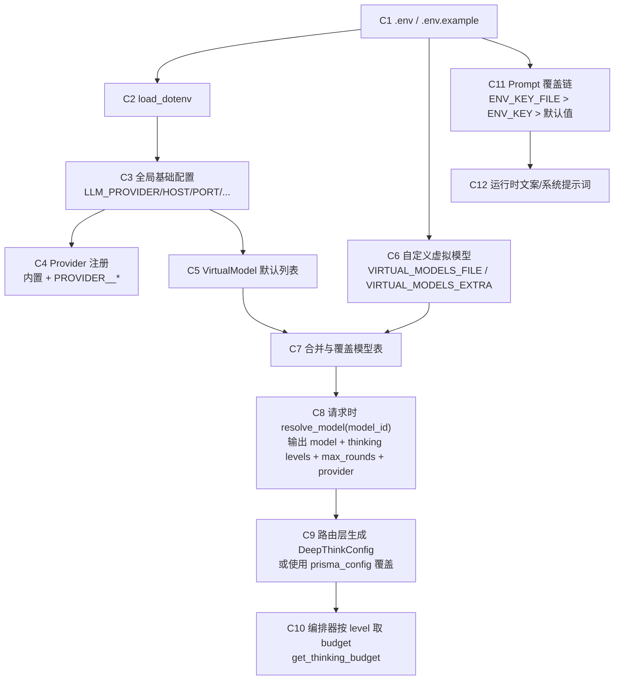
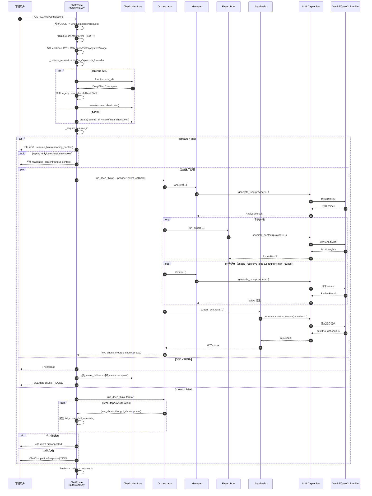
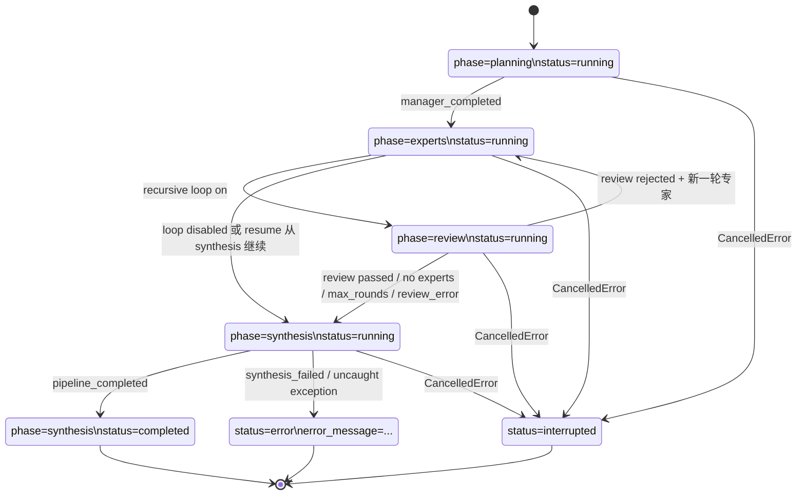

# Prisma API DeepThink 流程文档

本文档基于当前 `prisma-api` 目录源码整理，重点覆盖 DeepThink 后端在 `/v1/chat/completions` 入口下的真实执行流程、配置解析链路、断点续跑机制与实现差异。

## 基本原理（Architecture）

```mermaid
flowchart LR
    A1["A1 下游用户<br/>POST /v1/chat/completions"] --> A2["A2 FastAPI 路由入口<br/>routes/chat.py"]
    A2 --> A3["A3 请求预处理<br/>解析 messages/system/image/continue"]
    A3 --> A4["A4 模型与配置解析<br/>resolve_model + DeepThinkConfig"]
    A4 --> A5["A5 Checkpoint 与并发锁<br/>create/load/save + resume_id 锁"]
    A5 --> A6["A6 Orchestrator 启动<br/>run_deep_think"]
    A6 --> A7["A7 Planning<br/>manager.analyze"]
    A7 --> A8["A8 Experts 并行执行<br/>expert.run_expert"]
    A8 --> A9{"A9 Review 循环<br/>manager.review"}
    A9 -->|通过/终止循环| A10["A10 Synthesis 流式综合<br/>synthesis.stream_synthesis"]
    A9 -->|继续迭代| A8
    A10 --> A11["A11 Provider 无关调度<br/>clients.llm_client"]
    A11 --> A12{"A12 provider 类型"}
    A12 -->|gemini| A13["A13 Gemini client"]
    A12 -->|openai| A14["A14 OpenAI client"]
    A13 --> A15["A15 输出组装<br/>SSE 或 JSON"]
    A14 --> A15
    A15 --> A16["A16 返回下游用户"]
```

| 步骤ID | 运行行为 | 函数/类 | 文件路径 |
| --- | --- | --- | --- |
| A2 | 进入 OpenAI 兼容聊天路由 | `chat_completions` | `prisma-api/routes/chat.py` |
| A3 | 提取 query/history/system/image，处理 `!deepthink_continue` | `_get_query` / `_build_history` / `_extract_system_prompt` / `_extract_image_parts` / `_parse_continue_command` | `prisma-api/routes/chat.py` |
| A4 | 解析虚拟模型到真实模型、thinking level、provider | `_resolve_request` / `resolve_model` / `DeepThinkConfig` | `prisma-api/routes/chat.py` + `prisma-api/config.py` + `prisma-api/models.py` |
| A5 | 创建或加载 checkpoint，控制同 `resume_id` 并发 | `CheckpointStore` / `_acquire_resume_id` / `_release_resume_id` | `prisma-api/engine/checkpoint_store.py` + `prisma-api/routes/chat.py` |
| A6 | 启动统一编排器并持续产出 chunk | `run_deep_think` | `prisma-api/engine/orchestrator.py` |
| A7 | 经理模型规划专家团队 | `analyze` | `prisma-api/engine/manager.py` |
| A8 | 多专家并行非流式调用 | `run_expert` | `prisma-api/engine/expert.py` |
| A9 | 审查结果并决定 keep/iterate/delete | `review` / `_apply_review_actions` | `prisma-api/engine/manager.py` + `prisma-api/engine/orchestrator.py` |
| A10 | 汇总全部专家结果并流式输出 | `stream_synthesis` | `prisma-api/engine/synthesis.py` |
| A11-A14 | 按 provider 转发到 Gemini/OpenAI 客户端 | `generate_json` / `generate_content` / `generate_content_stream` | `prisma-api/clients/llm_client.py` + `prisma-api/clients/gemini_client.py` + `prisma-api/clients/openai_client.py` |
| A15 | 组装 SSE chunk 或非流式 JSON | `_generate_sse_stream` / `ChatCompletionResponse` | `prisma-api/routes/chat.py` + `prisma-api/models.py` |

## 配置解析（Config Resolution）

| 步骤ID | 运行行为 | 函数/类 | 文件路径 |
| --- | --- | --- | --- |
| C2 | 加载环境变量 | `load_dotenv` | `prisma-api/config.py` + `prisma-api/prompts.py` |
| C3 | 读取全局开关和服务参数 | 模块级配置常量 | `prisma-api/config.py` |
| C4 | 组装 provider 配置（含自定义 provider） | `ProviderConfig` / `_load_provider_configs` / `get_provider_config` | `prisma-api/config.py` |
| C5-C7 | 默认虚拟模型与额外模型合并 | `VirtualModel` / `_load_extra_virtual_models` / `_merge_virtual_models` | `prisma-api/config.py` |
| C8 | 请求模型解析 | `resolve_model` | `prisma-api/config.py` |
| C9 | 生成本次请求 DeepThink 配置 | `_resolve_request` / `DeepThinkConfig` | `prisma-api/routes/chat.py` + `prisma-api/models.py` |
| C10 | 各阶段 thinking budget 计算 | `get_thinking_budget` | `prisma-api/config.py` |
| C11-C12 | Prompt 覆盖优先级与运行时消息 | `_load_prompt` + 各 `*_PROMPT` / `MSG_*` 常量 | `prisma-api/prompts.py` |

## DeepThink 详细流程（从 /v1/chat/completions 开始）

| 步骤ID | 运行行为 | 函数/类 | 文件路径 |
| --- | --- | --- | --- |
| D1 | HTTP 入口与请求解析 | `chat_completions` / `ChatCompletionRequest` | `prisma-api/routes/chat.py` + `prisma-api/models.py` |
| D2 | continue 命令识别与参数提取 | `_parse_continue_command` / `_get_query` / `_build_history` | `prisma-api/routes/chat.py` |
| D3 | 断点创建、加载、修复与持久化 | `CheckpointStore.create/load/save` | `prisma-api/engine/checkpoint_store.py` |
| D4 | SSE 主流程封装 | `_generate_sse_stream` | `prisma-api/routes/chat.py` |
| D5 | 编排总入口 | `run_deep_think` / `_pipeline` | `prisma-api/engine/orchestrator.py` |
| D6 | 规划阶段 | `manager.analyze` | `prisma-api/engine/manager.py` |
| D7 | 专家执行阶段 | `expert.run_expert` | `prisma-api/engine/expert.py` |
| D8 | 审查与迭代阶段 | `manager.review` / `_apply_review_actions` | `prisma-api/engine/manager.py` + `prisma-api/engine/orchestrator.py` |
| D9 | 综合阶段 | `stream_synthesis` | `prisma-api/engine/synthesis.py` |
| D10 | provider 分发调用 | `clients.llm_client.*` | `prisma-api/clients/llm_client.py` |
| D11 | 实际上游调用与重试 | `gemini_client.*` / `openai_client.*` / `with_retry` | `prisma-api/clients/*.py` + `prisma-api/utils/retry.py` |
| D12 | 非流式断连保护 | `_wait_for_client_disconnect` | `prisma-api/routes/chat.py` |

## Resume / Checkpoint 机制

| 步骤ID | 运行行为 | 函数/类 | 文件路径 |
| --- | --- | --- | --- |
| R1 | resume_id 合法性校验与路径约束 | `is_valid_resume_id` / `_path_for` | `prisma-api/engine/checkpoint_store.py` |
| R2 | 创建初始 checkpoint | `CheckpointStore.create` | `prisma-api/engine/checkpoint_store.py` |
| R3 | 断点加载优先 fallback 文件 | `CheckpointStore.load` | `prisma-api/engine/checkpoint_store.py` |
| R4 | 原子写入与 fallback 写入 | `CheckpointStore.save` | `prisma-api/engine/checkpoint_store.py` |
| R5 | 执行中持续更新 phase/status/content | `_sync_checkpoint` / `_set_phase` / `_record_chunk` | `prisma-api/engine/orchestrator.py` |
| R6 | 请求层定时持久化回调 | `_persist_event` | `prisma-api/routes/chat.py` |
| R7 | 完成/中断/错误状态收敛 | `run_deep_think` 的 `except/else/finally` | `prisma-api/engine/orchestrator.py` |

## 代码映射表（流程节点 -> 文件/函数）

| 流程节点 | 文件/函数 |
| --- | --- |
| API 入口 | `routes/chat.py::chat_completions` |
| 请求模型 | `models.py::ChatCompletionRequest` |
| 模型解析 | `routes/chat.py::_resolve_request` + `config.py::resolve_model` |
| 虚拟模型定义 | `config.py::VirtualModel` + `VIRTUAL_MODELS` |
| provider 配置 | `config.py::ProviderConfig` + `_load_provider_configs` + `get_provider_config` |
| 规划 | `engine/manager.py::analyze` |
| 专家执行 | `engine/expert.py::run_expert` |
| 审查 | `engine/manager.py::review` |
| 审查动作应用 | `engine/orchestrator.py::_apply_review_actions` |
| 综合 | `engine/synthesis.py::stream_synthesis` |
| 编排入口 | `engine/orchestrator.py::run_deep_think` |
| 编排主循环 | `engine/orchestrator.py::_pipeline` |
| LLM 抽象层 | `clients/llm_client.py::{generate_json, generate_content, generate_content_stream}` |
| Gemini 调用 | `clients/gemini_client.py::{generate_json, generate_content, generate_content_stream}` |
| OpenAI 调用 | `clients/openai_client.py::{generate_json, generate_content, generate_content_stream}` |
| 重试策略 | `utils/retry.py::with_retry` |
| Checkpoint 存储 | `engine/checkpoint_store.py::CheckpointStore` |
| Prompt 覆盖机制 | `prompts.py::_load_prompt` |

## 公共 API / 接口 / 类型说明

### 1. 接口

| 方法 | 路径 | 说明 |
| --- | --- | --- |
| `POST` | `/v1/chat/completions` | OpenAI 兼容聊天接口，支持流式/非流式与断点续跑 |
| `GET` | `/v1/models` | 返回虚拟模型列表 |

### 2. 请求扩展字段

- `ChatCompletionRequest.prisma_config`：Prisma 扩展配置，可覆盖默认 `planning_level` / `expert_level` / `synthesis_level` / `max_rounds` / `max_context_messages`。
- 最后一条 `user` 消息支持：
`!deepthink_continue <id>` 或 `/continue <id>`，用于恢复对应 checkpoint。

### 3. 响应关键点

- 流式 SSE 中并行输出：
  - `delta.reasoning_content`
  - `delta.content`
- 非流式响应在 `message` 中返回：
  - `content`
  - `reasoning_content`（若有）

### 4. Checkpoint 核心字段

`DeepThinkCheckpoint` 关键字段：
- `phase`
- `status`
- `current_round`
- `reasoning_content`
- `output_content`

## 当前实现差异说明（真实行为 + 风险注记）

1. `resolve_model` 已返回 `provider`，并已透传到 `run_deep_think -> manager/expert/synthesis -> llm_client -> provider client` 整条链路。  
2. `.env.example` 当前未完整覆盖所有实现支持项，尤其：
   - `CHECKPOINT_DIR`
   - `CHECKPOINT_SCHEMA_VERSION`
   - `CHECKPOINT_REPLAY_CHUNK_SIZE`
   - `PROVIDER_<NAME>_API_KEY`
   - `PROVIDER_<NAME>_BASE_URL`
   - `PROVIDER_<NAME>_TYPE`
3. `main.py` 启动前置检查仍按全局 `LLM_PROVIDER` 判断主 API Key，这与“请求期按虚拟模型 provider 分流”是两层机制：
   - 启动层：全局 provider 健康门槛
   - 运行层：每个请求可通过虚拟模型解析到具体 provider
4. 部分历史文案/注释存在编码遗留（源码中文注释乱码），不影响主流程，但建议后续统一编码与文档语言源。

## 文档验收场景

1. 标准流式请求：先收到 role 首包，再持续收到 `reasoning_content` 与 `content`，最终 `[DONE]`。  
2. 非流式请求：服务端聚合 `full_content/full_reasoning` 后一次性返回 `ChatCompletionResponse`。  
3. resume 已完成：使用 `!deepthink_continue <id>` 直接 replay 历史输出。  
4. resume 未完成：从 checkpoint 继续执行剩余阶段。  
5. 同一 `resume_id` 并发执行：返回 `409`。  
6. checkpoint 不存在：返回 `404`。  
7. synthesis 异常：输出 `SYNTHESIS_FALLBACK_TEXT`，并将 checkpoint 标记为 `error`。  
